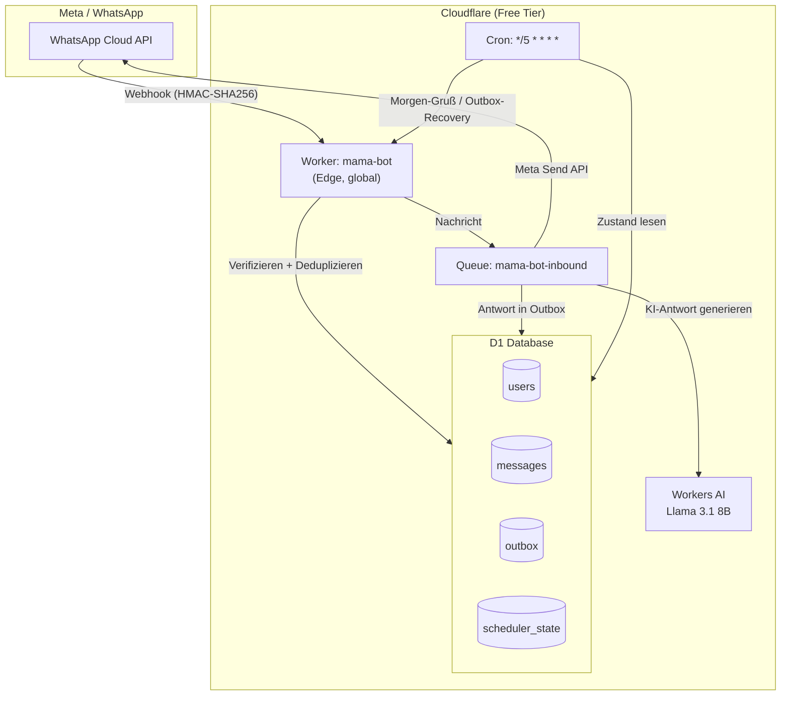
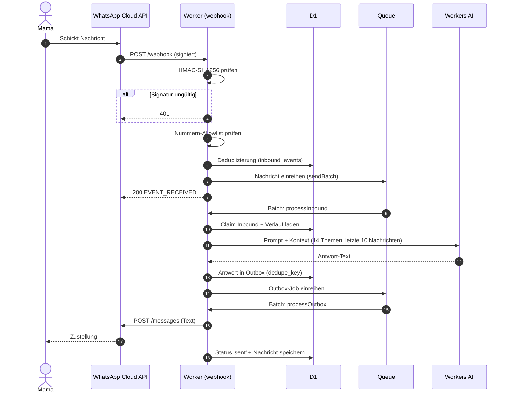
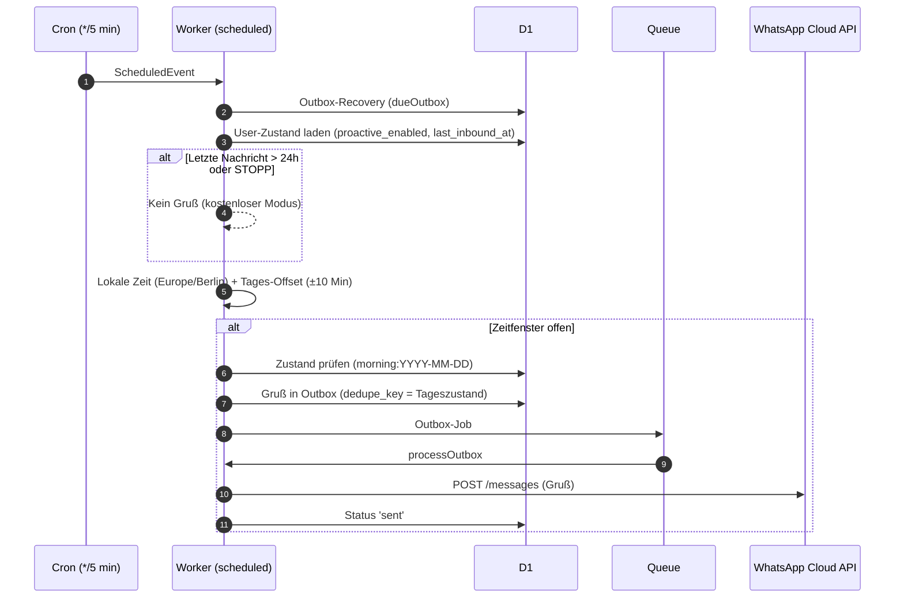
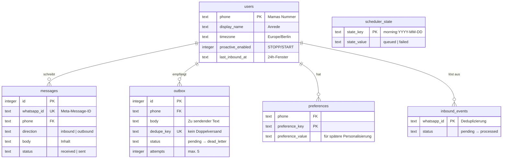
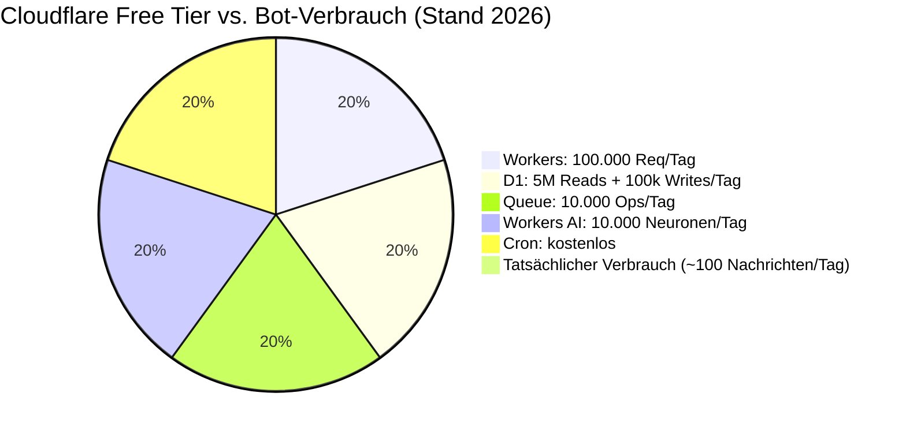

<div align="center">

# 🤖 Mama Bot

Ein warmer, deutschsprachiger **WhatsApp-Begleiter für Mama** — mit italienischer Küche, Toskana, Reisen, Meer und kleinen Wissenshäppchen.

[](https://www.typescriptlang.org/)
[](https://workers.cloudflare.com/)
[](https://developers.cloudflare.com/d1/)
[](https://developers.cloudflare.com/workers-ai/)
[](https://developers.facebook.com/docs/whatsapp/cloud-api)
[](https://github.com/maxkru92/mama-bot/actions)
[]()

**100 % kostenlos betreibbar** im Cloudflare Free Tier — offizielle Meta WhatsApp Cloud API, keine Green-API, kein WAHA, kein Server.

</div>

---

## 📖 Inhalt

- [Eigenschaften](#eigenschaften)
- [Architektur](#architektur)
- [Nachrichtenfluss](#nachrichtenfluss)
- [Morgen-Gruß](#morgen-gruß)
- [Datenmodell](#datenmodell)
- [Kosten: 0 €/Monat](#kosten-0-eurmonat)
- [Schnellstart](#schnellstart)
- [Meta-Einrichtung](#meta-einrichtung)
- [Projektstruktur](#projektstruktur)
- [Konfiguration](#konfiguration)
- [Entwicklung & Tests](#entwicklung--tests)
- [Sicherheit](#sicherheit)
- [Lizenz](#lizenz)

---

## ✨ Eigenschaften

| | |
|---|---|
| 🔐 | Offizieller **Meta-Webhook** mit Verify-Token und HMAC-SHA256-Signaturprüfung |
| 🗄️ | **D1** (serverless SQLite) für Gespräche, Präferenzen, Einwilligung, Outbox und Audit-Log |
| 📬 | **Cloudflare Queue** für verzögerte Verarbeitung, Retries und Dead-Letter-Steuerung |
| ⏰ | **Cron-Trigger** alle 5 Minuten für Morgen-Gruß und Outbox-Recovery |
| 🧠 | **Workers AI** (Llama 3.1 8B) mit deterministischem Fallback bei KI- oder Quotenfehlern |
| 🔁 | Deduplizierung von Meta-Retries, at-least-once-Zustellung mit begrenzten Retries |
| 👥 | Nummern-Allowlist: **nur Mamas Nummer** wird verarbeitet |
| 🛑 | `STOPP`, `PAUSE` und `START` steuern die proaktiven Nachrichten |
| 🍝 | 14 kuratierte Themen: Italien, Toskana, Meer, Reisen, Rezepte, Wein, Feste & mehr |
| 🎲 | Morgen-Gruß zu einer **leicht variierenden Uhrzeit** (±10 Min, deterministisch pro Tag) |
| 🧪 | 11 Unit-Tests, Typecheck und Prettier — CI via GitHub Actions |

---

## 🏗️ Architektur



**Warum Cloudflare Workers?** Der Bot ist ein einzelner, zustandsloser Worker an der Edge — kein Server, keine Docker-Container, kein Monitoring-Setup. Alles (Datenbank, Queue, Cron, KI) ist in einer Plattform gebündelt und komplett im Free Tier.

---

## 🔄 Nachrichtenfluss

So verarbeitet der Bot eine eingehende WhatsApp-Nachricht:



---

## ⏰ Morgen-Gruß

Der tägliche Gruß kommt nur, wenn Mamas letzte Nachricht **maximal 24 Stunden** zurückliegt — so bleibt der Versand im kostenlosen Meta-Kundenservicefenster:



Die Nachricht selbst wird **deterministisch pro Tag** aus 12 kuratierten Grüßen gewählt — variierende Uhrzeit, wechselnde Inhalte, kein Roboter-Gefühl.

---

## 🗄️ Datenmodell



---

## 💰 Kosten: 0 €/Monat



| Komponente | Free-Tier | Bot-Verbrauch | Kosten |
|---|---|---|---|
| Workers | 100.000 Requests/Tag | ~100/Tag | **0 €** |
| D1 | 5 GB, 5 M Reads/Tag | winzige Datenmenge | **0 €** |
| Queue | 10.000 Ops/Tag | ~50/Tag | **0 €** |
| Cron-Trigger | unbegrenzt | alle 5 Min | **0 €** |
| Workers AI | 10.000 Neuronen/Tag | ~100 Neuronen/Nachricht | **0 €** |
| WhatsApp (Meta) | Antworten im 24h-Fenster kostenlos | nur im Fenster | **0 €** |

**Zero-Cost-Garantien im Code:**
- Der Bot versendet proaktiv **nur**, wenn Mamas letzte Nachricht ≤ 24 h zurückliegt (kostenloses Meta-Fenster).
- Bei erschöpfter KI-Quote antwortet er mit kuratierten Fallback-Texten statt Kosten zu erzeugen.
- `STOPP` deaktiviert alle proaktiven Nachrichten sofort.
- Kein Server, keine Templates, keine Marketing-Nachrichten.

> Hinweis: Meta plant ab Oktober 2026 eine kleine Gebühr pro Service-Nachricht im 24h-Fenster. Das ist eine Meta-Preisentscheidung, die kein Anbieter umgehen kann — die Cloudflare-Seite bleibt zu 100 % kostenlos.

---

## 🚀 Schnellstart

Voraussetzungen: [Node.js 20+](https://nodejs.org), [Wrangler 4+](https://developers.cloudflare.com/workers/wrangler/), ein kostenloses Cloudflare-Konto und die Meta-Zugangsdaten (siehe [Meta-Einrichtung](#meta-einrichtung)).

```bash
# 1. Abhängigkeiten installieren
npm install

# 2. Meta-Zugangsdaten eintragen
cp secrets.env.example secrets.env
# ... secrets.env mit den Werten aus META_SETUP.md füllen

# 3. Einmalig bei Cloudflare einloggen (öffnet Browser)
npx wrangler login

# 4. Secrets setzen
./deploy.sh secrets

# 5. Infrastruktur + Deploy (D1, Queue, Migrationen, Checks, Deploy)
./deploy.sh
```

`deploy.sh` erledigt alles automatisch: Login-Check, Queue-Erstellung, D1-ID, Migrationen, Secrets aus `secrets.env`, Typecheck/Tests und Deployment.

### Manuell (ohne Skript)

```bash
npx wrangler d1 create mama-bot-db        # ID in wrangler.toml eintragen
npx wrangler queues create mama-bot-inbound
npm run db:remote                          # Migrationen
npx wrangler secret put WHATSAPP_TOKEN
npx wrangler secret put WHATSAPP_PHONE_NUMBER_ID
npx wrangler secret put WHATSAPP_VERIFY_TOKEN
npx wrangler secret put META_APP_SECRET
npx wrangler secret put MOTHER_PHONE
npm run check && npm run deploy
```

Danach im Meta-Dashboard als Callback-URL eintragen:

```
https://mama-bot.<dein-subdomain>.workers.dev/webhook
```

---

## 🔑 Meta-Einrichtung

Die komplette Schritt-für-Schritt-Anleitung (App anlegen, Testnummer, permanentes Token, Webhook) steht in **[`META_SETUP.md`](./META_SETUP.md)** — einmalig ~10 Minuten, danach ist alles automatisiert.

---

## 📁 Projektstruktur

```text
mama-bot/
├── src/
│   ├── index.ts              # Worker-Einstieg (fetch, scheduled, queue)
│   ├── webhook.ts            # Meta-Webhook: Verify + HMAC + Deduplizierung
│   ├── processor.ts          # Inbound-Verarbeitung + Outbox-Zustellung
│   ├── scheduler.ts          # Morgen-Gruß + Outbox-Recovery (Cron)
│   ├── db.ts                 # D1-Zugriff (users, messages, outbox, …)
│   ├── types.ts              # Gemeinsame Typen
│   ├── config/
│   │   ├── env.ts            # Pflicht-Secrets-Prüfung
│   │   └── topics.ts         # 14 Themen + 12 Morgen-Grüße
│   └── lib/
│       ├── ai.ts             # Workers AI Prompt + Fallback
│       ├── commands.ts       # STOPP / START / HILFE
│       ├── fallback.ts       # Deterministische Fallback-Antworten
│       ├── signature.ts      # HMAC-SHA256-Verifikation
│       ├── time.ts           # Zeitzonen + Morgen-Varianz
│       └── whatsapp.ts       # Meta Send API Client
├── migrations/
│   └── 0001_initial.sql      # D1-Schema
├── test/                     # 11 Unit-Tests (Vitest)
├── .github/workflows/check.yml  # CI: format + typecheck + tests
├── deploy.sh                 # Vollautomatisches Deployment
├── secrets.env.example       # Template für Meta-Secrets (NIEMALS committen)
├── META_SETUP.md             # Meta-Einrichtungsanleitung
└── wrangler.toml             # Cloudflare-Konfiguration
```

---

## ⚙️ Konfiguration

| Variable | Zweck | Standard |
|---|---|---|
| `MOTHER_PHONE` | Mamas Nummer ohne `+` | — (Pflicht) |
| `WHATSAPP_TOKEN` | Meta Access Token | — (Pflicht) |
| `WHATSAPP_PHONE_NUMBER_ID` | Meta Phone Number ID | — (Pflicht) |
| `WHATSAPP_VERIFY_TOKEN` | Webhook-Verify-Token | — (Pflicht) |
| `META_APP_SECRET` | App-Secret für HMAC | — (Pflicht) |
| `MOTHER_TIMEZONE` | Zeitzone für Morgen-Gruß | `Europe/Berlin` |
| `MORNING_HOUR` / `MORNING_MINUTE` | Zielzeit des Grußes | `8:00` |
| `MORNING_VARIANCE_MINUTES` | Varianz der Grußzeit | `10` |
| `MOTHER_NAME` | Persönliche Anrede | `Mama` |
| `AI_MODEL` | Workers-AI-Modell | `@cf/meta/llama-3.1-8b-instruct-fp8-fast` |
| `MAX_REPLY_CHARS` | Maximale Antwortlänge | `2800` |

---

## 🧪 Entwicklung & Tests

```bash
npm run dev            # Lokaler Worker (wrangler dev)
npm run typecheck      # TypeScript-Checks
npm test               # 11 Unit-Tests (Vitest)
npm run format:check   # Prettier
npm run check          # Alles zusammen (CI-Stufe)
```

CI läuft automatisch bei jedem Push/PR über **GitHub Actions** (`npm run check`).

---

## 🔒 Sicherheit

- **Secrets niemals committen**: `secrets.env`, `.dev.vars` und `.env` sind gitignored.
- **HMAC-SHA256**: Jeder Webhook-Aufruf wird gegen `META_APP_SECRET` verifiziert.
- **Nummern-Allowlist**: Nur `MOTHER_PHONE` wird verarbeitet.
- **Deduplizierung**: Meta-Retries erzeugen keine Doppelverarbeitung.
- **At-least-once**: Outbox mit max. 5 Versuchen und Dead-Letter-Status.
- **Sicherheitsgrenzen**: Der Bot ist kein Arzt, Notruf oder Rechtsberater; bei Notfällen verweist er auf **112**.
- Details: [`SECURITY.md`](./SECURITY.md)

---

## 📜 Lizenz

MIT — siehe [`LICENSE`](./LICENSE).
